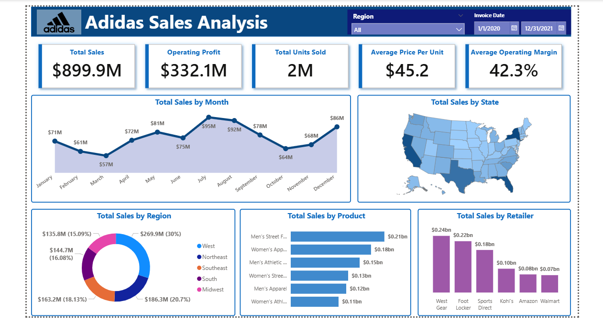

## 📊 Adidas US Sales Dashboard (2020–2021)

Built an interactive Power BI dashboard to analyze Adidas US sales performance across regions, products, and retailers. The project focuses on identifying key revenue drivers and supporting data-driven business decisions.

---

## 🎯 Business Objective
Analyze Adidas US sales data to identify top-performing regions, products, and retailers, and uncover trends that can support sales strategy and business growth.

---

## 📊 Key KPIs
- Total Sales  
- Operating Profit  
- Units Sold  
- Average Price per Unit  
- Operating Margin  


---

## 📂 Project Structure

```
Dashboard-Adidas-Sales-Analysis/
│── README.md
│
├── data/
│ └── raw/
│
├── dashboard/
│ ├── adidas_sales_analysis.pbix
│ └── exports/
│    ├── Dashboard.pdf
│    └── screenshots/
│
└── Project_Report.pdf
```

---

## 📷 Dashboard Preview

Here is a preview of the Adidas US Sales Dashboard:



---

## 📊 Dataset

The dataset comes from **Adidas US Sales (2020–2021)**, available [here](https://drive.google.com/drive/folders/1xF_oXU9JWYKetobyWk-nv84v9ep5yGJQ).

---

## 📌 Key Insights

- The West region generates the highest overall sales, indicating strong market performance in that area  
- A small number of retailers (e.g., West Gear) contribute significantly to total revenue  
- Sales peak during July–August, highlighting strong seasonal demand  
- Men’s Street Footwear is the top-performing product category, driving a large portion of total sales  

---

## 💡 Business Recommendations

- Focus marketing and inventory efforts on high-performing regions like the West  
- Strengthen partnerships with top retailers to maximize revenue  
- Leverage seasonal demand by planning promotions during peak months  
- Expand top-selling product categories to increase overall sales performance

---


