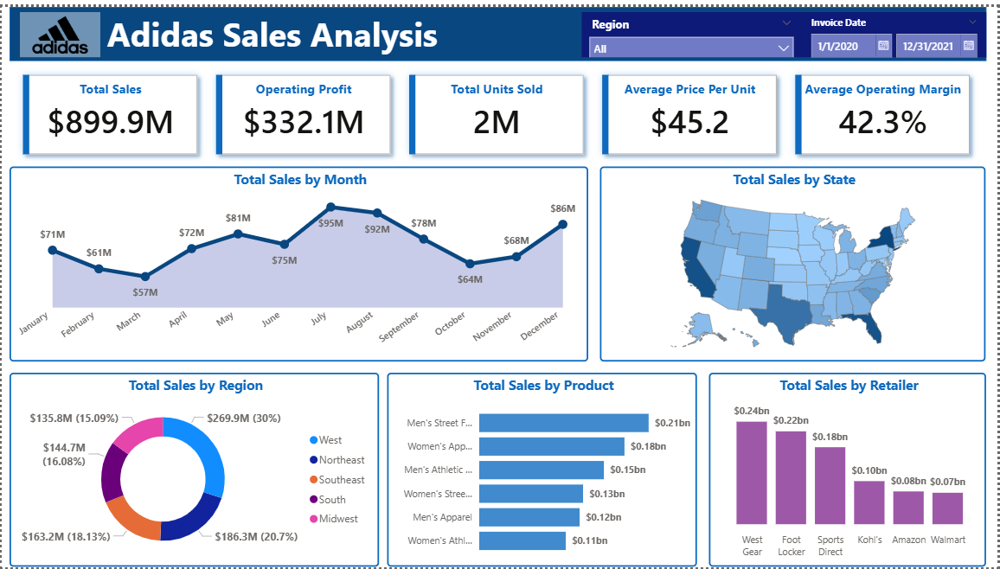

# 📊 Adidas US Sales Dashboard (2020–2021)

> This project analyzes Adidas US Sales data (2020–2021) using Power BI.
> The dashboard provides a comprehensive view of sales performance across regions, states, products, and retailers.
> Key KPIs and visuals help uncover trends and insights for better business decisions.

---

## 📌 Objectives

- Track and monitor Adidas sales performance in the US.
- Identify top-performing regions, states, products, and retailers.
- Analyze seasonality and monthly sales trends.
- Provide interactive slicers for filtering by region and invoice date.

---

## 📌 Key KPIs

The dashboard highlights five major KPIs:

- 💵 Total Sales
- 📈 Operating Profit
- 📦 Total Units Sold
- 🏷️ Average Price per Unit
- 📊 Average Operating Margin

---

## 📊 Dashboard Visuals

The following visuals are included in the report:

**_Total Sales by Month (Area Graph)_**

> Peaks observed in July–August, indicating strong seasonal demand.

**_Total Sales by State (Shape Map)_**

> New York records the highest sales among all states.

**_Total Sales by Region (Donut Chart)_**

> The West Region dominates overall sales performance.

**_Total Sales by Product (Column Chart)_**

> Men’s Street Footwear leads as the top-selling product category.

**_Total Sales by Retailer (Bar Chart)_**

> West Gear emerges as the highest contributing retailer.

Interactive Slicers:

- Region filter
- Invoice Date filter (from 2020-01-01 to 2021-12-31)

---

## 📂 Project Structure

```
Dashboard-Adidas-Sales-Analysis/
│── README.md
│
├── data/
│ └── raw/
│
├── dashboard/
│ ├── adidas_sales_analysis.pbix
│ └── exports/
│    ├── Dashboard.pdf
│    └── screenshots/
│
└── Project_Report.pdf
```

---

## 📷 Dashboard Preview

Here is a preview of the Adidas US Sales Dashboard:




---

## 📊 Dataset

The dataset comes from **Adidas US Sales (2020–2021)**, available [here](https://drive.google.com/drive/folders/1xF_oXU9JWYKetobyWk-nv84v9ep5yGJQ).

---

## Tools & Technologies

- Power BI Desktop (Data visualization & dashboard building)
- Excel/Google Sheets (Data source)
- GitHub (Version control & portfolio hosting)

---

## 🙋‍♂️ Author

**Md. Hasib** <br>
_BSc Statistics Student, University of Chittagong_ <br>
Email: mdhasib.stats@gmail.com <br>
GitHub: [@mdhasibstats](https://github.com/mdhasibstats)

---
